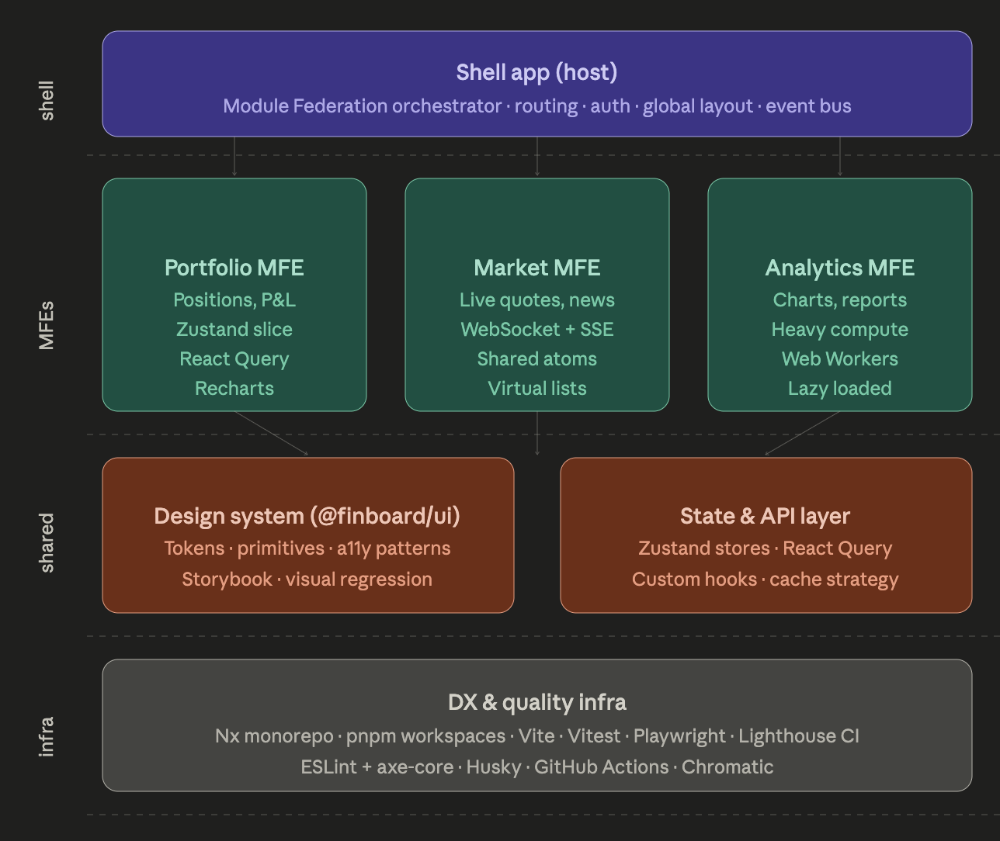

finboard/
├── apps/
│ ├── shell/ ← Host app (React + Module Federation)
│ ├── mfe-portfolio/ ← Remote MFE
│ ├── mfe-market/ ← Remote MFE
│ └── mfe-analytics/ ← Remote MFE
├── packages/
│ ├── ui/ ← Design system (headless + styled)
│ ├── state/ ← Shared Zustand stores + React Query config
│ ├── api-client/ ← Generated OpenAPI client + hooks
│ └── utils/ ← Pure utilities (no React deps)
└── tools/
└── generators/ ← Nx generators for new MFE scaffolding
